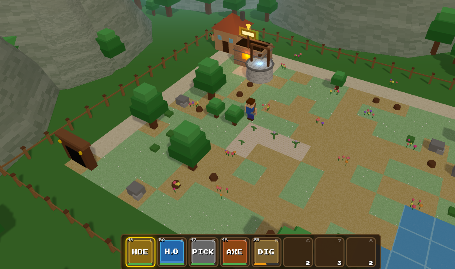

# Till Debt Do Us Part



A tiny Harvest Moon-style farming sim in the browser. Clear your rundown farm, plant crops, dig the mine, upgrade your tools… and pay back the pesky guy who wants his money.

## 🎮 [Play Now](https://sc0d3r.github.io/till-debt-do-us-part/)

## How to Play

- **WASD / Arrows**: Move
- **Space**: Action (clear debris, till, plant, water, harvest, dig in mine)
- **E**: Interact (open shop, enter/exit mine, refill watering can at well)
- **Enter**: Sleep (must be on house tile) - advances day, restores stamina
- **B**: Ship items (drop sellable held item into shipping bin)
- **1-8**: Select inventory slot

### Goal
You inherited a run-down farm with 5,000 gold in debt. Pay it off by day 21 or lose the farm.

### Tips
- Clear debris → till soil → plant seeds → water daily → harvest when ripe
- Visit the shop to buy seeds, repair tools, and upgrade equipment
- Enter the mine to dig for ores and gems; find the ladder to go deeper
- Refill your watering can at the well (press E near it)
- Ship crops and minerals via the shipping bin (press B while holding an item)
- Upgrade tools at the shop to reduce stamina costs
- Mr. Grimes visits every 5 days to collect payment
- Tools have durability — repair them at the shop before they break

## Development

```bash
npm install
npm run dev      # Start dev server
npm run build    # Production build
npm run preview  # Preview production build
```

## Tech Stack
- TypeScript + Three.js + Vite
- Pure client-side, no backend required
- Procedural textures and meshes (no external model files)
- Saves to localStorage

---

## 🇮🇷 بخش فارسی

# تا بدهکاری ما را جدا کند

یک بازی کوچک مزرعه‌داری به سبک Harvest Moon در مرورگر. مزرعه متروکه خود را آباد کنید، محصول بکارید، معدن کاوش کنید، ابزارهایتان را ارتقا دهید… و بدهی‌تان را به آقای گرایمز پرداخت کنید!

## 🎮 [همین حالا بازی کنید](https://sc0d3r.github.io/till-debt-do-us-part/)

## راهنمای بازی

- **WASD / کلیدهای جهت‌نما**: حرکت
- **Space**: عمل (پاکسازی، شخم زدن، کاشت، آبیاری، برداشت، حفاری در معدن)
- **E**: تعامل (باز کردن فروشگاه، ورود/خروج از معدن، پر کردن آبپاش در چاه)
- **Enter**: خواب (باید روی کاشی خانه باشید) - روز بعد شروع می‌شود، استقامت بازیابی می‌شود
- **B**: ارسال آیتم (آیتم قابل فروش در دست را در جعبه ارسال بیندازید)
- **1-8**: انتخاب اسلات کوله‌پشتی

### هدف
شما یک مزرعه متروکه با ۵۰۰ سکه بدهی به ارث بردید. تا روز ۲۱ بدهی را پرداخت کنید یا مزرعه را از دست بدهید.

### نکات
- پاکسازی → شخم زدن → کاشت بذر → آبیاری روزانه → برداشت هنگام رسیدن
- به فروشگاه بروید تا بذر بخرید، ابزار تعمیر کنید و تجهیزات ارتقا دهید
- وارد معدن شوید و سنگ معدن و جواهر پیدا کنید؛ نردبان را پیدا کنید تا عمیق‌تر بروید
- آبپاش خود را در چاه پر کنید (کنار چاه E را بزنید)
- محصولات و مواد معدنی را از طریق جعبه ارسال بفروشید (با نگه داشتن آیتم B را بزنید)
- ابزارها را در فروشگاه ارتقا دهید تا هزینه استقامت کاهش یابد
- آقای گرایمز هر ۵ روز برای جمع‌آوری پرداخت مراجعه می‌کند
- ابزارها دوام دارند — قبل از شکستن در فروشگاه تعمیرشان کنید

## توسعه

```bash
npm install
npm run dev      # راه‌اندازی سرور توسعه
npm run build    # ساخت نسخه تولید
npm run preview  # پیش‌نمایش نسخه تولید
```

## تکنولوژی‌ها
- TypeScript + Three.js + Vite
- کاملاً سمت کلاینت، بدون نیاز به سرور
- بافت‌ها و مش‌های رویه‌ای (بدون فایل مدل خارجی)
- ذخیره در localStorage
